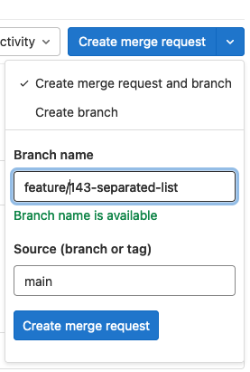

# CI/CD Pipeline Details

!!! warning "Under Construction"

    This page is still being written
    

The default LTC pipeline runs the following jobs:

1. gather_info
1. analyze_for_tagging
1. build
1. test
1. deploy
1. cleanup

!!! example "Triggering a CI/CD Pipeline"

    1. Create an Issue
    1. Create a Merge Request and a branch

        
    1. Open a code editor and checkout the new branch
    1. Develop locally using `docker compose up` and `skaffold dev`
    1. Commit changes and push to GitLab


## Repository Configuration

To get started, make sure your project has the following:

1. `main` branch = default, protected
1. `release` branch = protected
1. deployment files
    - a template `deploy` folder can be found in the `Templates` group
1. a `.gitlab-ci.yaml` pipeline file
    - a template CI/CD pipeline file can be found in the `Templates` group

Next, authenticate to [Vault](https://vault.ltc.bcit.ca:8200)

    vault login method=ldap username={yourBCITemail}

Open a terminal and run the `Templates`>`auth-init.sh` script to establish a connection between your GitLab source code, Vault, and Kubernetes. This script:

- creates GitLab Project Access Tokens and stores them in Vault
- creates Vault roles to allow GitLab-Runner to read secrets
- creates Vault roles to allow Kubernetes to read secrets

## Semantic Versioning

We use [Semantic Versioning](https://semver.org/) to automatically determine whether a tag is considered "major", "minor", or "patch. `semantic-release` analyzes commit messages and increments versions based on the type of keyword included in a commit message.

[Semantic release](https://semantic-release.gitbook.io/semantic-release/) uses a token to push a git tag with an appropriate version number to the repository.

    1. Create a project access token with the name `semantic-release-{project-name}

    See https://docs.gitlab.com/ee/api/resource_access_tokens.html#create-a-project-access-token

```
curl --request POST --header "PRIVATE-TOKEN: <your_access_token>" \
--header "Content-Type:application/json" \
--data '{ "name":"semantic-release-qcon-api", "scopes":["api", "write_repository"]' \
"https://gitlab.example.com/api/v4/projects/250/access_tokens"
```

    1. create a vault token at the path /secrets/access-tokens/semantic-release-{project-name} with:
        ```
        Key=GITLAB_TOKEN
        Value={token}
        ```
