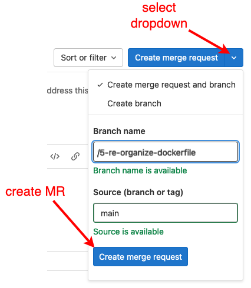
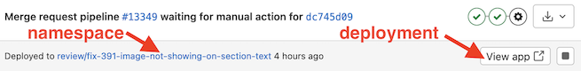

# Pipeline initialization

When the default pipeline runs for the first time, it initializes the project by connecting GitLab to systems like Vault and Kubernetes. If you navigate to the GitLab `CI/CD > Pipelines` page you can monitor the status of pipelines.

The default pipeline has a couple of *stages*, and each stage has one or more **jobs**. Click on an icon in the stages column to see the status of individual jobs.

A commit to the `main` branch will trigger the pipeline, and the `deploy latest` job will print out the following:

    #####
    #####
    #####            GENERIC_DEPLOYMENT is set.
    #####
    #####
    #####
    #####
    #####
    #####  Projects with 'GENERIC_DEPLOYMENT=true' deploy an example 'generic-dev' workload
    #####    from development branches only (anything other than 'main').
    #####
    #####    For example:
    #####
    #####    * a8c5228 (HEAD -> 1-branch, origin/1-branch)    ==> Triggers example 
    #####    |                                                     'generic-dev' deployment
    #####    |
    #####    | * 147a67d (origin/main, origin/HEAD, main)     ==> this message
    #####    |/  
    #####    * 7e6529f Initial commit (.gitlab-ci.yml)
    #####
    #####
    #####
    #####
    #####
    #####    This is the 'main' branch. To verify the pipeline can deploy the example
    #####      'generic-dev' workload:
    #####
    #####      1) create an issue
    #####      2) create a merge request
    #####      3) checkout and commit a change to the new branch
    #####
    #####    Committing to any branch other than 'main' triggers an example deployment 
    #####      that can be reviewed at https://review.ltc.bcit.ca/{projectName}/{branchName}.
    #####
    #####    The deployment can also be accessed by clicking the 'View App' button 
    #####      on the merge request.
    #####
    #####
    #####
    #####
    #####
    #####    When you are ready to deploy your app you'll need:
    #####
    #####      1) A Dockerfile that builds without errors (confirm with 'docker build .')
    #####      2) A deployment package:
    #####
    #####        a) set DEPLOY_PKG_INIT="true" in your '.gitab-ci.yml' file
    #####        b) clone the deployment package (deployments/{projectName}
    #####        c) configure the overlays
    #####
    #####        See https://infrastructure-documentation.ltc.bcit.ca for more info.
    #####
    #####      3) Finally, retrieve the project ID from the deployment package project
    #####          and add it to your '.gitlab-ci.yml' file. Comment out GENERIC_PACKAGE 
    #####          and push a commit.
    #####
    #####        View your deployment in the 'Deployments > Environments' page. 
    #####
    #####
    #####
    #####

If you see a message like the one above, the pipeline is configured correctly! It confirms the following:

    * the `Dockerfile` can be built successfully
    * the integration between GitLab and the secret manager, Vault, is configured correctly
    * a **GENERIC_DEPLOYMENT** is configured

Out-of-the-box, the pipeline is configured with a generic deployment so that the basic connections between systems are configured correctly. After we replace the generic package with a package specific to our project we'll be able to deploy code from the `main` branch.

## First deployment

To verify that GitLab can deploy to Kubernetes, create a `feature` or `fix` development branch and make a commit to that branch:

1. Create an Issue (eg. `updates README with project description`)
2. Create a Merge Request (MR) and a new branch

    

3. Open a code editor and checkout the new branch
4. Add/replace content in the `README.md` to describe the project
5. Commit the changes and push to the repo

The push triggers a pipeline that deploys the work in your branch to a cluster for `review`. If you look at the **CI/CD > Pipelines** page you should see the pipeline's progress.

!!! note "`review` deployments"

    Commits to a branch other than `main` trigger a deployment to the Kubernetes cluster specified in the `.gitlab-ci.yml` file. The default *generic deployment package* is a simple `nginx` workload that confirms that the GitLab can deploy to Kubernetes.

    To confirm that GitLab can deploy to Kubernetes:

    1. Look at the top of your GitLab MR:

        

    1. Click the **View App** button to navigate to the deployment

    If you see something like this, you've successfully deployed a workload to Kubernetes!

    
    
