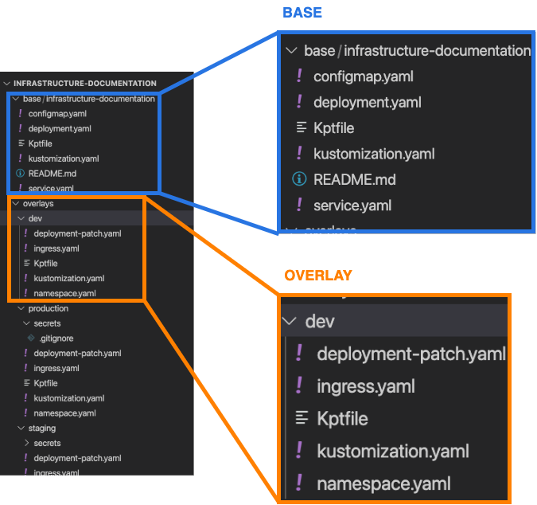

# `deploy/` configuration details

!!! warning "Under Construction"

    This page is still being written

A deployment configuration is built around [`kustomize`](https://kubectl.docs.kubernetes.io/), where a *base* set of configuration files are modified by *overlays* before being applied to a cluster.

Here's what the structure of a kustomize-based *deployment package* looks like:

<!-- markdownlint-disable MD033 -->
<figure markdown>
{ width="500" }
  <figcaption>An example nginx deployment package</figcaption>
</figure>

## Base

The base in the example above consists of some standard KRM's:

* `configmap.yaml`

    Because this package is based on `nginx`, it also includes a `configmap.yaml` that contains `nginx.conf` settings.

* `deployment.yaml`
* `kustomization.yaml`

    A kustomize specification file. It describes the resources that should be applied to the cluster.

* `service.yaml`

## Overlays

The files in the overlay are *patches* that describe how a resource is changed when it is applied to a cluster.

In the example above, the `dev` cluster overlay adds a `deployment-patch.yaml`, an `ingress.yaml`, and a `namespace.yaml` to change the way the package is deployed. In a similar vein, there are files in the `latest` and `stable` overlays which make adjustments to the workloads applied to the `latest` and `stable` clusters, respectively.

## First steps *kustomizing* the `deploy/` configuration files

The **generic-dev** `deploy/` folder contains example bases that might help give you an idea about how different workloads can be structured. The package also has example `review`, `latest`, and `stable` overlays that can be used as starting points for the kustomization.

=== "nginx-unprivileged"

    * deployment.yaml
    * service.yaml

=== "mysql"

    * deployment.yaml
    * pvc.yaml
    * service.yaml

=== "nodejs-mongodb"

    * **mongo-express**
        * deployment.yaml

    * service.yaml

=== "wordpress"

    * **deployment**
        * volume.yaml
        * wordpress-deployment.yaml

    * **mysql**
        * mysql-deployment.yaml

    * service.yaml

=== "`review` overlay"

    * ingress.yaml
    * kustomization.yaml
    * Kptfile
    * serviceaccount.yaml
    * `secrets/` path
