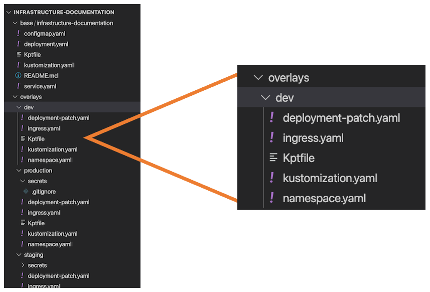

# Deployment Packages

!!! warning "Under Construction"

    This page is still being written...

The default pipeline file can help you get started with an automated build and deploy, but it's not configured to do much right out of the box - it requires some configuration before you can see your app on a cluster.

Up until now, we've talked about the `Dockerfile` and the `CI/CD pipeline configuration file`. But the other part of the picture is the set of KRM's you use to tell the cluster how to deploy your app. These files are called a **deployment package**.

A deployment package is built around [`kustomize`](https://kubectl.docs.kubernetes.io/), where there's a base set of configuration files that get modified by *overlays* based on the cluster they're being applied to.

Here's what the structure of a kustomize-based deployment package looks like:

The files in the `dev` path are *patches* that configure the deployment for a `dev` cluster. Similarly, the files in the `production` path are patches for the `production` cluster.

!!! tip "Creating a Deployment Package"

    To have the Default CI/CD pipeline create a "generic" deployment package that you can start working with, look for the **DEPLOY_PKG_INIT** flag at the bottom of the `.gitlab-ci.yml` file and uncomment it. Commit this change to trigger the creation of a simple deployment package.

Once this deployment package has been created, it can be *kustomized* to work with your app image so that it can be deployed to a cluster.

## Deployment pipeline

