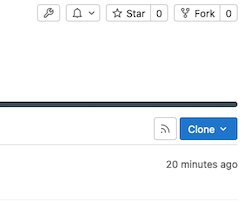
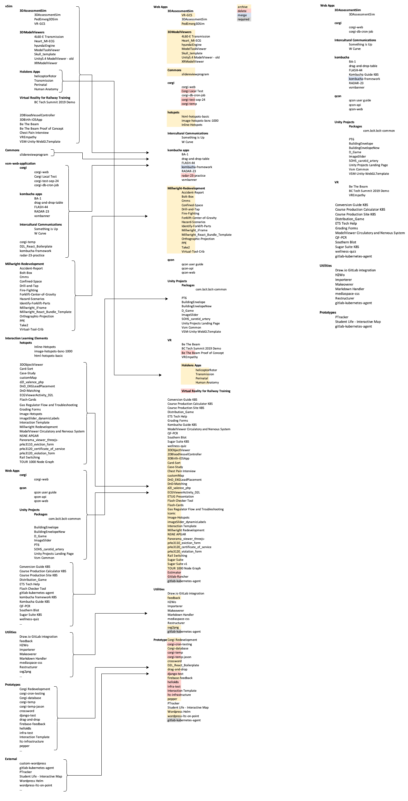

# Code Repositories

!!! tip inline end "LTC Code Repository"

    [https://issues.ltc.bcit.ca](https://issues.ltc.bcit.ca)

    To clone a repo, click the blue "Clone" button at the top right of a project:

    

A central component to the LTC's development is the code repository, GitLab. This platform offers a convenient way to centrally access and manage code.

The LTC also has repositories on other platforms like GitHub ([BCIT-LTC](https://github.com/bcit-ltc)) and BitBucket ([BCIT Bitbucket](), Bitbucket.com), but GitLab is considered to be the authoritiative source for the applications that we develop.

In addition to storing source code, GitLab also enables teams to rapidly test and develop their apps through a deployment pipeline that is securely connected with the LTC's Kubernetes clusters.

The CI/CD deployment pipeline and the Kubernetes cluster endpoints are described in other sections.

!!! note ""

    ## Re-organizing Groups

    An [initiative to re-organize GitLab](https://issues.ltc.bcit.ca/ltc-infrastructure/infrastructure-documentation/-/issues/57) is underway which will clarify where new projects should be located.

    The proposed work is outlined below.
    
    
