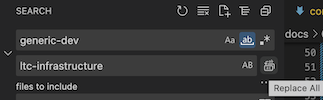

<!-- markdownlint-disable MD025 -->

# Continuous deployment overview

After [initializing the project](./getting-started.md) the next step is to replace the generic deployment with your own project's info. Here's how to do that.

!!! tip "Working knowledge of the following is helpful..."

    * Kubernetes resources(deployments, services, ingresses)
    * Basic Kustomize concepts (bases, overlays, builds)

## Deployment configuration files

Your project runs the pipeline that builds your app, but it's a combination of the files in the `deploy/` folder and a continuous delivery tool called [FluxCD](https://fluxcd.io/flux/) that actually deploys your app to Kubernetes.

The default deployment is built around [`kustomize`](https://kubectl.docs.kubernetes.io/), where a *base* set of configuration files are modified by *overlays* before being applied to a cluster.

The pipeline is configured to deploy the `review` overlay to a *review* cluster, the `latest` overlay to the *latest* cluster, and the `stable` overlay to the *stable* cluster.

## `generic` deployment package

When the [default `deploy/` folder](https://issues.ltc.bcit.ca/ltc-infrastructure/base-packages.git) is first used in your project, it configures GitLab to deploy a generic worlkoad to Kubernetes. If you create a merge request and a branch, and then commit a change and push this branch, you can view this `generic` deployment by clicking on the `View App` button in the merge request.

The easiest way to replace the generic deployment with your own project's configuration is to perform a **"Find and Replace** on everything in the `deploy/` folder.

1. Create an issue; call it something like *"initial deployment package"*
2. Create a merge request (MR) and a branch

    

3. Checkout the branch; the branch name is at the top of the MR
4. Navigate to the `deploy/` folder
5. Run a **Find and Replace** on the contents of the folder:

    - use the GUI to replace all instances of **"generic-dev"** (match whole word) with the name of your project (eg. **"ltc-infrastructure"**)

        

    OR

    - run something like:

            sed -i -- 's/generic-dev/yourAppName/g' deploy/*

6. Commit and push the changes
7. Navigate to the `CI/CD > Pipelines` page to monitor the pipeline progress

The pipeline will build an image and attempt to deploy your app to the `review` cluster.

!!! failure "If your pipeline fails..."

    You may need to make small changes to your deployment package `review` overlay for the pipeline to complete successfully. Consider the following:

    - is `nginx` an appropriate base?
    - does your deployment require additional configuration (via a ConfigMap resource)?
    - does the base **Service** resource port need adjustment? If yes, don't change the base, just add a kustomize patch to the overlay.

## `latest` and `stable` overlays

After you have a working `review` overlay, most of the "heavy lifting" is done; the biggest difference between this overlay and the `latest`/`stable` overlays has to do with routing and security.

To deploy to `latest` (or `stable`), make a commit to the `main` branch (with a [semantic version keyword](semantic-versioning.md)).
